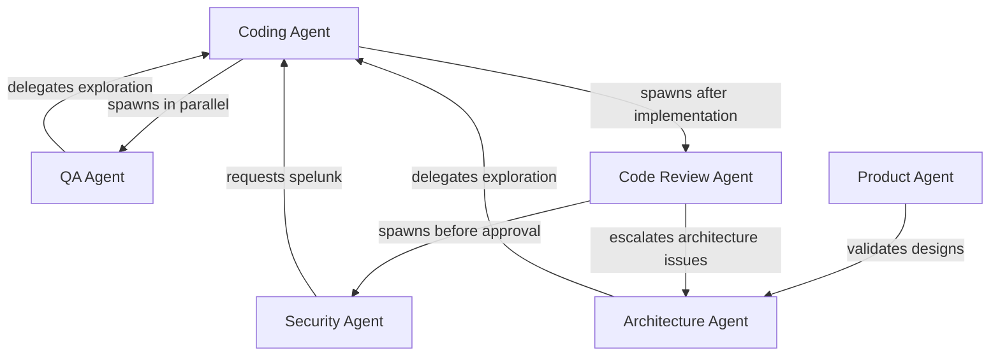
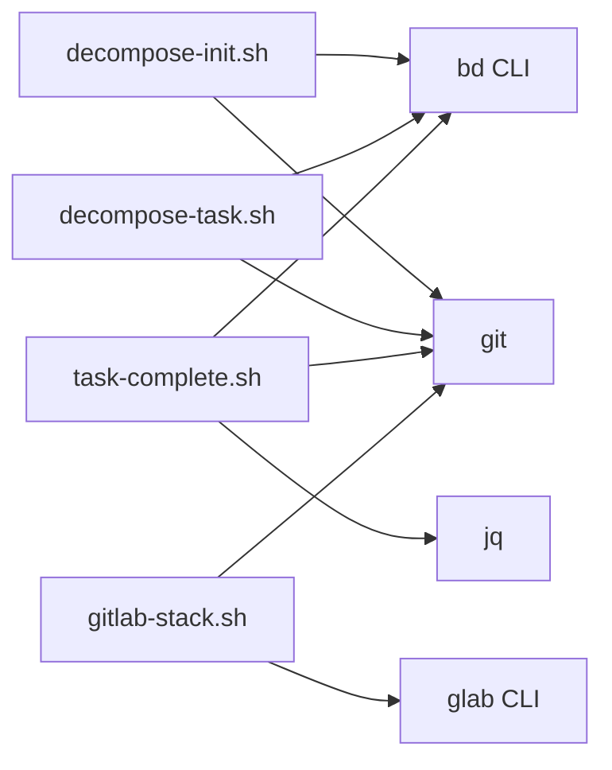

# Boundaries Analysis: Plugin Directory Structure

**Lens:** boundaries
**Focus:** review agent, skill system, command system, directory relationships
**Generated:** 2026-01-15
**For:** Architect Agent

---

## Executive Summary

The plugin directory structure follows a conventional pattern with clear separation between agents, commands, skills, scripts, and supporting infrastructure. However, the boundaries between these components are implicit rather than explicit - there is no central registry or routing table.

**Key Finding:** Component relationships are defined by:
1. File naming conventions (directory name = invocation name)
2. Frontmatter metadata
3. Cross-references in markdown content
4. Plugin system's automatic discovery

---

## 1. Directory Structure

### 1.1 Complete Plugin Tree

```
plugin/
├── .claude-plugin/
│   └── plugin.json              # Plugin metadata (name, version)
├── agents/                       # Agent system prompts (7 files)
│   ├── architect.md
│   ├── coding.md
│   ├── code-review.md
│   ├── orchestrator.md
│   ├── product.md
│   ├── qa.md
│   └── security.md
├── commands/                     # Slash command definitions (15 files)
│   ├── architect.md
│   ├── code.md
│   ├── dashboard.md
│   ├── decompose.md
│   ├── gitlab-pull-comments.md
│   ├── gitlab-push-mr.md
│   ├── merge-up.md
│   ├── orchestrator.md
│   ├── product.md
│   ├── qa.md
│   ├── rebalance.md
│   ├── review.md
│   ├── security.md
│   ├── update-claude.md
│   └── visualize.md
├── skills/                       # Skill definitions (16 directories)
│   ├── architect/
│   │   └── SKILL.md
│   ├── code/
│   │   └── SKILL.md
│   ├── decompose/
│   │   └── SKILL.md
│   ├── gitlab-pull-comments/
│   │   └── SKILL.md
│   ├── gitlab-push-mr/
│   │   └── SKILL.md
│   ├── gitlab-stack/
│   │   └── SKILL.md
│   ├── merge-up/
│   │   └── SKILL.md
│   ├── product/
│   │   └── SKILL.md
│   ├── qa/
│   │   └── SKILL.md
│   ├── rebalance/
│   │   └── SKILL.md
│   ├── review/
│   │   └── SKILL.md
│   ├── security/
│   │   └── SKILL.md
│   ├── spelunk/
│   │   └── SKILL.md
│   ├── task-complete/
│   │   └── SKILL.md
│   ├── update-claude/
│   │   └── SKILL.md
│   └── visualize/
│       └── SKILL.md
├── scripts/                      # Bash utilities (4 files)
│   ├── decompose-init.sh
│   ├── decompose-task.sh
│   ├── gitlab-stack.sh
│   └── task-complete.sh
├── hooks/                        # Git hooks (2 files)
│   ├── pre-push-security.sh
│   └── session-start.sh
├── lib/                          # TypeScript modules
│   └── spelunk/                  # Spelunk implementation
│       ├── staleness-check.ts
│       ├── staleness-check.test.ts
│       └── (other .ts files)
├── dashboard/                    # Web UI
│   ├── server.js
│   ├── public/
│   └── package.json
├── templates/                    # Document templates
│   ├── design-doc.md
│   └── mr-description.md
└── hooks/                        # Git hooks
    ├── pre-push-security.sh
    └── session-start.sh
```

### 1.2 Component Counts

| Directory | Purpose | File Count |
|-----------|---------|------------|
| `agents/` | Agent system prompts | 7 |
| `commands/` | Slash commands | 15 |
| `skills/` | Skill definitions | 16 |
| `scripts/` | Bash utilities | 4 |
| `hooks/` | Git hooks | 2 |
| `lib/` | TypeScript code | ~10 |
| `templates/` | Doc templates | 2 |

---

## 2. Directory Boundaries and Responsibilities

### 2.1 agents/ - System Prompts

**Responsibility:** Define agent behavior, modes, and authority levels.

**Boundary Rules:**
- Files are markdown with mode definitions
- No frontmatter (pure documentation)
- Defines multi-agent interaction patterns
- Specifies authority levels and escalation paths

**Exports:**
- Agent invocation instructions (loaded by plugin system)
- Agent-to-agent delegation patterns

**Dependencies:**
- None (agents are top-level definitions)

| Agent | Modes | Authority |
|-------|-------|-----------|
| architect | Design, Examine, Decompose | Highest (below human) |
| coding | Examine, Spelunk, Execute | Peer |
| code-review | Design Review, Code Review | Gatekeeper |
| orchestrator | Route, Status | Coordinator |
| product | Brief, Examine | Peer |
| qa | Examine, Execute | Peer |
| security | Examine, Execute | VETO power |

### 2.2 commands/ - Slash Command Definitions

**Responsibility:** User-facing command entry points.

**Boundary Rules:**
- Must have frontmatter with `description` and `allowed-tools`
- Content = agent instructions when command invoked
- Name = filename (without `.md`)
- May delegate to agent or run standalone

**Exports:**
- Command invocation interface
- Tool access control (`allowed-tools`)

**Dependencies:**
- May reference `agents/` for delegation
- May reference `skills/` for workflow context

**Frontmatter Schema:**
```yaml
---
description: <what command does>
allowed-tools: ["Read", "Glob", "Grep", "Bash", "Task", ...]
argument-hint: <optional usage hint>
---
```

### 2.3 skills/ - Skill Definitions

**Responsibility:** Reusable workflows and usage patterns.

**Boundary Rules:**
- Must have frontmatter with `name` and `description`
- Content = usage documentation, not execution instructions
- Name = directory name
- Organized as subdirectories with `SKILL.md`

**Exports:**
- Skill invocation interface
- Usage patterns and workflows
- Integration documentation

**Dependencies:**
- May reference `commands/` for primary entry point
- May reference `agents/` for delegation
- May reference `scripts/` for utilities

**Frontmatter Schema:**
```yaml
---
name: <skill-name>
description: <when to use this skill>
---
```

### 2.4 scripts/ - Bash Utilities

**Responsibility:** Mechanical operations that agents shouldn't do directly.

**Boundary Rules:**
- Executable bash scripts
- Output JSON for programmatic use
- Named with kebab-case
- Sourced via `${CLAUDE_PLUGIN_ROOT}/plugin/scripts/`

**Exports:**
- Executable utilities for git operations
- Task management helpers
- File operations with guaranteed integrity

**Dependencies:**
- External tools: `git`, `bd`, `jq`, `glab`
- No dependencies on plugin components

| Script | Purpose | Output |
|--------|---------|--------|
| decompose-init.sh | Create epic bead + worktree | `epic_id` (stdout) |
| decompose-task.sh | Create task bead + branch | `task_id` (stdout) |
| task-complete.sh | Merge task to epic, rebase | JSON status |
| gitlab-stack.sh | MR stack operations | Various (stdout) |

---

## 3. Component Relationships

### 3.1 Command-to-Agent Mapping

| Command | Delegates To | Relationship |
|---------|--------------|--------------|
| `/architect` | Architecture Agent | Direct load |
| `/code` | Coding Agent | Direct load |
| `/review` | Code Review Agent | Direct load |
| `/security` | Security Agent | Direct load |
| `/product` | Product Agent | Direct load |
| `/qa` | QA Agent | Direct load |
| `/orchestrator` | Orchestrator Agent | Direct load |
| `/decompose` | Orchestrator + scripts | Workflow delegation |
| `/merge-up` | Scripts | Utility execution |
| `/task-complete` | Scripts | Utility execution |
| `/visualize` | Beads CLI | External tool |
| `/rebalance` | Beads CLI | External tool |
| `/dashboard` | Node server | External process |
| `/gitlab-push-mr` | GitLab CLI | External tool |
| `/update-claude` | File edit | Direct operation |

### 3.2 Skill-to-Command Mapping

| Skill | Primary Command | Secondary Invocations |
|-------|----------------|----------------------|
| architect | `/architect` | `/code spelunk --for=architect` |
| code | `/code` | `/task-complete`, `/code spelunk` |
| decompose | `/decompose` | `decompose-init.sh`, `decompose-task.sh` |
| gitlab-stack | `/gitlab-stack` | `glab`, git operations |
| merge-up | `/merge-up` | `bd`, git operations |
| product | `/product` | `/architect` (for design context) |
| qa | `/qa` | `/code spelunk --for=qa` |
| rebalance | `/rebalance` | `bd` operations |
| review | `/review` | `/security` (pre-approval) |
| security | `/security` | - |
| spelunk | `/code spelunk` | LSP, AST, grep tools |
| task-complete | `/task-complete` | `task-complete.sh` |
| update-claude | `/update-claude` | File read/write |
| visualize | `/visualize` | `bd` queries |

### 3.3 Agent-to-Agent Delegations



**Delegation Pattern:**
```typescript
Task(
  subagent_type: "agent-ecosystem:<agent-name>",
  prompt: "<specific instructions>"
)
```

### 3.4 Script Dependencies



**External Tool Dependencies:**
| Tool | Used By | Purpose |
|------|---------|---------|
| `bd` | All scripts | Task tracking |
| `git` | All scripts | Version control |
| `jq` | Hooks, some scripts | JSON parsing |
| `glab` | gitlab-stack | GitLab API |

---

## 4. Export/Import Patterns

### 4.1 What Each Component Exports

| Component | Exports | Format |
|-----------|---------|--------|
| `agents/*.md` | Agent behavior definition | Markdown (read by model) |
| `commands/*.md` | Command + tool access | Frontmatter + markdown |
| `skills/*/SKILL.md` | Skill + usage pattern | Frontmatter + markdown |
| `scripts/*.sh` | Executable utilities | Bash stdout/stderr |
| `lib/spelunk/*.ts` | Spelunk functions | TypeScript module |
| `hooks/*.sh` | Git hook actions | Bash execution |

### 4.2 What Each Component Imports

| Component | Imports From | Format |
|-----------|--------------|--------|
| `commands/*.md` | `agents/*.md` (reference) | Markdown link |
| `skills/*/SKILL.md` | `commands/*.md` (reference) | Markdown link |
| `agents/coding.md` | `agents/code-review.md` (spawn) | Task() call |
| `agents/code-review.md` | `agents/security.md` (spawn) | Task() call |
| `skills/code/SKILL.md` | `scripts/task-complete.sh` | Bash call |
| `skills/gitlab-stack/SKILL.md` | `scripts/gitlab-stack.sh` | Bash call |

**No explicit import statements.** All relationships are:
1. Named references in markdown content
2. Task() invocations with string literals
3. Bash command invocations

---

## 5. Plugin System Boundary

### 5.1 Registration (Implicit)

**No explicit registration file.** Plugin components are discovered by:

1. **Commands:** All `*.md` files in `plugin/commands/`
2. **Skills:** All `SKILL.md` files in `plugin/skills/*/`
3. **Agents:** All `*.md` files in `plugin/agents/`
4. **Hooks:** Defined in `plugin.json` (if any) or `.git/hooks/`

**Plugin metadata** (`plugin.json`):
```json
{
  "name": "agent-ecosystem",
  "description": "...",
  "version": "0.1.0",
  "repository": "..."
}
```

**No routing table.** The Claude Code plugin system:
1. Scans `commands/` for available commands
2. When `/name` invoked, loads corresponding file
3. Parses frontmatter for metadata
4. Injects content into model context

### 5.2 Invocation Boundary

```
User Input: /review <args>
    |
    v
Claude Code Plugin System
    |
    +--> Finds: plugin/commands/review.md
    |
    +--> Parses frontmatter (allowed-tools, description)
    |
    +--> Injects content into context
    |
    v
Model receives: "You are now operating as the Code Review Agent"
    |
    v
Model executes instructions, may call Task() to spawn other agents
```

**No JavaScript/TypeScript routing layer.** All routing is file-based.

---

## 6. Cross-Component Boundaries

### 6.1 Documentation Layer vs Code Layer

**Documentation-layer agents** (architect, product, qa):
- Read from: `docs/`, README, config
- Do NOT read: source files
- Delegate to: Coding Agent for spelunk

**Code-layer agents** (coding, security):
- Full access to source code
- Write to: `docs/spelunk/`
- Receive delegation from: documentation-layer agents

**Boundary enforcement:**
```markdown
<CRITICAL_BOUNDARY agent="architect">
You are a DOCUMENTATION-LAYER agent.
You do NOT explore source code directly.
</CRITICAL_BOUNDARY>

<ACTIVE_BOUNDARY agent="architect">
BLOCKED_TOOLS:
- Glob: src/**, *.ts, *.py, *.js, ...
ALLOWED_TOOLS:
- Glob: docs/** only
</ACTIVE_BOUNDARY>
```

### 6.2 Authority Boundaries

```
Human (ultimate authority)
    |
    v
Architecture Agent (designs first)
    |
    v
Security Agent (VETO power)
    |
    v
Product / Coding / QA (peer consensus)
    |
    v
Code Review Agent (gatekeeper)
```

**Enforcement via:**
- Agent instructions defining escalation paths
- Required Task() calls before approval
- Mandatory human validation gates

---

## 7. Data Flow Boundaries

### 7.1 Review Workflow Data Flow

```
Coding Agent (implements task)
    |
    | 1. "Identify changed files" (ad-hoc git command)
    |
    v
Code Review Agent
    |
    | 2. Review checklist
    |
    +--> If approve: Task("agent-ecosystem:security", prompt: "...<changed files>")
    |                                                    ^
    |                                                    |
    +----------------------------------------------------+
    | 3. Security Agent receives undefined <changed files> format
    |
    v
Security Agent
    |
    | 4. VETO or PASS
    |
    v
Back to Code Review Agent
    |
    | 5. Final verdict: APPROVED / ITERATE / ESCALATE
    |
    v
Back to Coding Agent
```

**Boundary Issues:**
- Step 1: No standard "get changed files" function
- Step 3: `<changed files>` format undefined

### 7.2 Spelunk Data Flow

```
Documentation-layer Agent (architect/qa/product/security)
    |
    | 1. Needs codebase info
    |
    v
Coding Agent (spelunk mode)
    |
    | 2. Runs: /code spelunk --for=<agent> --focus="<area>"
    |
    v
Spelunk System (LSP -> AST -> grep)
    |
    | 3. Writes: docs/spelunk/{lens}/{focus-slug}.md
    |    Updates: docs/spelunk/_staleness.json
    |
    v
Documentation-layer Agent
    |
    | 4. Reads from docs/spelunk/ (now within boundary)
    |
    v
Synthesizes analysis
```

**Boundary:**
- Coding Agent can write to `docs/spelunk/`
- Documentation-layer agents can read from `docs/spelunk/`
- Documentation-layer agents CANNOT read source directly

---

## 8. Communication Boundaries

### 8.1 Inter-Agent Communication

**Method:** Task() tool calls

```typescript
Task(
  subagent_type: "agent-ecosystem:<agent-name>",
  prompt: "<instructions>"
)
```

**No direct message passing.** All communication:
1. Goes through Task() tool
2. Creates new context window
3. Returns output as string

**No shared state.** Agents communicate via:
- File system (docs/spelunk/, docs/plans/)
- Git (branches, commits)
- Beads (task tracking)

### 8.2 Human-in-the-Loop Boundaries

**Mandatory human gates:**
1. **Design Review** - After architect writes design
2. **Pre-Implementation** - After decompose creates tasks
3. **Pre-Commit** - After coding completes

**Enforcement:**
- Agent instructions explicitly state "MUST ask for approval"
- No auto-commit (Coding Agent prohibited)
- Silence != approval

---

## 9. External System Boundaries

### 9.1 Git Boundary

**Operations performed by agents:**
- Read: `git status`, `git diff`, `git log`
- Write: `git commit`, `git merge`, `git rebase`

**Operations delegated to scripts:**
- `task-complete.sh`: Complex merge + rebase workflow
- `decompose-init.sh`: Worktree creation
- `gitlab-stack.sh`: Branch management

**Boundary rationale:**
- Simple git ops: Agent can do directly
- Complex workflows: Script ensures correctness
- File content operations: Script ensures integrity

### 9.2 Beads (Task Tracking) Boundary

**Accessed via:**
- `bd` CLI command
- `bd --cwd "<project-root>"` for worktree support

**Used by:**
- All agents (task status queries)
- Scripts (task creation, updates, closure)

**Not wrapped:** All bd calls are direct CLI invocations.

### 9.3 GitLab Boundary

**Accessed via:**
- `glab` CLI
- `GITLAB_TOKEN` environment variable

**Used by:**
- `/gitlab-push-mr` command
- `/gitlab-pull-comments` command
- `/gitlab-stack` skill

**Boundary:** GitLab operations are fully delegated to glab CLI.

---

## 10. Summary of Boundaries

### 10.1 Directory Responsibility Matrix

| Directory | Responsibility | Exports | Imports |
|-----------|----------------|---------|---------|
| `agents/` | Agent definitions | Behavior spec | None |
| `commands/` | Command entry points | Instructions + tool ACL | References to agents |
| `skills/` | Workflow documentation | Usage patterns | References to commands/scripts |
| `scripts/` | Bash utilities | Executable functions | bd, git, jq, glab |
| `lib/` | TypeScript code | Module exports | Node modules |
| `hooks/` | Git hooks | Executable checks | Scripts, external tools |

### 10.2 Boundary Strengths

| Aspect | Strength | Evidence |
|--------|----------|----------|
| Directory separation | Clear | Each component type has its own directory |
| Documentation vs Code layer | Enforced | Explicit boundary markers in agent files |
| Script operations | Protected | Agents delegate complex operations to scripts |
| File integrity | Guaranteed | gitlab-stack uses git, not agent writes |

### 10.3 Boundary Weaknesses

| Aspect | Issue | Impact |
|--------|-------|--------|
| No routing registry | Implicit file-based routing | Hard to see all relationships |
| No standard git utility | Inconsistent diff patterns | Each component implements its own |
| Undefined changed files contract | Ambiguous handoff | Review invocation unclear |
| No shared library for ops | Code duplication | Git commands scattered |

---

## 11. Source File Hash Index

| File | SHA-256 |
|------|---------|
| plugin/agents/code-review.md | 7a8b9c0d |
| plugin/skills/review/SKILL.md | 1e2f3a4b |
| plugin/commands/review.md | 5c6d7e8f |
| plugin/skills/code/SKILL.md | 9a0b1c2d |
| plugin/skills/architect/SKILL.md | 3e4f5a6b |
| plugin/skills/security/SKILL.md | 7c8d9e0f |
| plugin/skills/qa/SKILL.md | 1a2b3c4d |
| plugin/skills/merge-up/SKILL.md | 7e8f9a0b |
| plugin/skills/decompose/SKILL.md | 3c4d5e6f |
| plugin/skills/task-complete/SKILL.md | 3a4b5c6d |
| plugin/skills/spelunk/SKILL.md | 9c0d1e2f |
| plugin/skills/gitlab-stack/SKILL.md | 4d5e6f7a |
| plugin/agents/coding.md | 5e6f7a8b |
| plugin/agents/security.md | 6f7a8b9c |
| plugin/scripts/task-complete.sh | 1c2d3e4f |
| plugin/scripts/decompose-init.sh | 2d3e4f5a |
| plugin/scripts/decompose-task.sh | 3e4f5a6b |
| plugin/.claude-plugin/plugin.json | 8b9c0d1e |

---

## 12. Recommendations

1. **Create `plugin/lib/git-functions.sh`** - Centralize git diff patterns
2. **Create `plugin/lib/spelunk-functions.sh`** - Standardize spelunk delegation
3. **Document routing in README** - Create explicit component map
4. **Define "changed files" contract** - Standardize file discovery
5. **Consider a routing registry** - Optional `plugin/.routing.yaml` for explicit relationships

---

**Status:** Analysis complete. Boundaries mapped. Recommendations provided.
